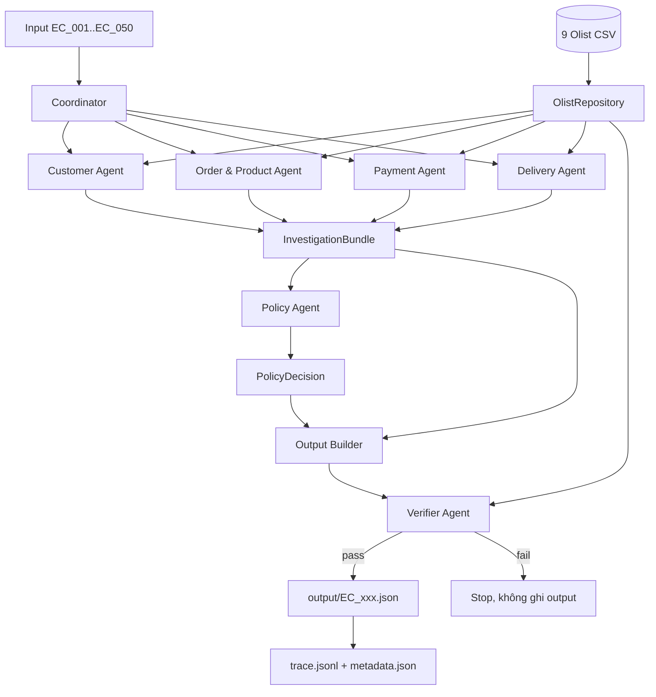

# Kiến trúc hệ thống Multi-Agent E-commerce Dispute Resolution

## 1. Mục tiêu thiết kế

Hệ thống điều tra 50 khiếu nại Olist theo `EC_POLICY_V2`. Kết luận chỉ dựa trên dữ liệu có thể kiểm chứng trong CSV. Các agent trao đổi bằng dataclass có kiểu rõ ràng; không agent nào tự tạo tracking event, refund transaction hoặc evidence không tồn tại.

Pipeline hiện dùng Python 3.10 và luật xác định, không gọi LLM. Vì vậy kết quả có thể tái lập hoàn toàn và không phát sinh model vượt giới hạn 10B parameters.

## 2. Sơ đồ agent và luồng handoff



## 3. Vai trò và quyền truy cập

| Thành phần | Trách nhiệm | Quyền dữ liệu |
| --- | --- | --- |
| Coordinator | Nhận case, gọi agent, gom handoff, gọi policy và verifier | Input case và contract; không sửa CSV |
| OlistRepository | Đọc 9 CSV một lần, lập index, giữ thứ tự nguồn | Chỉ đọc `data/` |
| Customer Agent | Xác định `customer_unique_id`, tối đa 5 order lịch sử | Orders và customers qua repository |
| Order & Product Agent | Item, seller, product, category và secondary flags | Orders, items, products, sellers |
| Payment Agent | Tổng item/freight/payment và reconciliation | Items và payments |
| Delivery Agent | Delivery variance, shipping limit sớm nhất theo seller | Orders và items |
| Policy Agent | Áp dụng thứ tự ưu tiên `EC_POLICY_V2` | Chỉ đọc `InvestigationBundle`, không đọc CSV |
| Output Builder | Ánh xạ bundle và decision sang submission schema | Chỉ đọc handoff |
| Verifier Agent | Hard gate schema, limit, policy, ID, evidence và null | Output, handoff và repository read-only |
| Batch Runner | Ghi output đã pass, thay trace của lần chạy mới nhất | Ghi `output/` và `logging/` |

Không agent nào có quyền sửa dữ liệu nguồn. Output chỉ được ghi sau khi Verifier hoàn tất không có lỗi.

## 4. Contract handoff

Các contract nằm trong `src/models.py`:

- `CaseInput`: case ID, message, claimed order, scope và policy version.
- `CustomerAnalysis`: customer unique ID, related orders, repeat flag.
- `OrderProductAnalysis`: order row, item rows và các ID/category ổn định.
- `PaymentAnalysis`: các tổng tiền bằng `Decimal`, difference và reconciled.
- `DeliveryAnalysis`: timestamp, variance và handoff theo seller.
- `InvestigationBundle`: kết quả hợp nhất của bốn domain agent.
- `PolicyDecision`: taxonomy, responsibility, refund và actions.

Policy Agent không nhận raw prompt của khách hàng để quyết định sự kiện. Nó nhận các fact đã được domain agent trích xuất từ CSV, nhờ đó lời khiếu nại không thể ghi đè bằng chứng nguồn.

## 5. Quy tắc xử lý quan trọng

- Policy được xét đúng thứ tự: canceled, unavailable, late seller, late logistics, valid split payment, unsupported late claim.
- Tiền dùng `Decimal`; số tiền và số giờ làm tròn hai chữ số.
- Payment reconciliation dùng sai số tối đa `0.10 BRL`.
- Shipping limit là timestamp sớm nhất của từng seller trong order.
- `customer_id` chỉ đại diện một order; lịch sử dùng `customer_unique_id`.
- Order không có item trả các tổng dự kiến/difference/reconciled bằng `null` và các mảng item-related rỗng.
- Danh sách giữ thứ tự nguồn, sau đó mới áp dụng giới hạn schema.

## 6. Evidence và verification gate

Evidence chỉ được tạo theo năm dạng đề cho phép. Verifier đối chiếu order, item, payment và seller với bundle/repository; policy evidence phải khớp root cause. Verifier cũng kiểm tra:

- đầy đủ và đúng thứ tự field cấp cao;
- confidence trong `[0, 1]`;
- refund nhất quán với `case_status`;
- primary/secondary/actions khớp Policy Agent;
- giới hạn tất cả array;
- evidence không trùng và không giả;
- null handling cho order không có item.

Nếu có lỗi, `VerificationError` dừng case trước bước ghi file.

## 7. Runtime, trace và tái lập

Chạy toàn bộ pipeline:

```powershell
python -m src.main --all
```

Chạy test:

```powershell
python -m unittest discover -s tests -v
```

Mỗi batch run ghi đè `logging/trace.jsonl`, gồm 8 event cho mỗi case: nhận case, bốn domain handoff, policy decision, verification pass và output written. `logging/metadata.json` ghi model, parameter size, framework, Python runtime, policy và thời điểm chạy.

Output được ghi qua file tạm rồi replace để tránh để lại JSON dở nếu tiến trình bị ngắt giữa lúc ghi.
